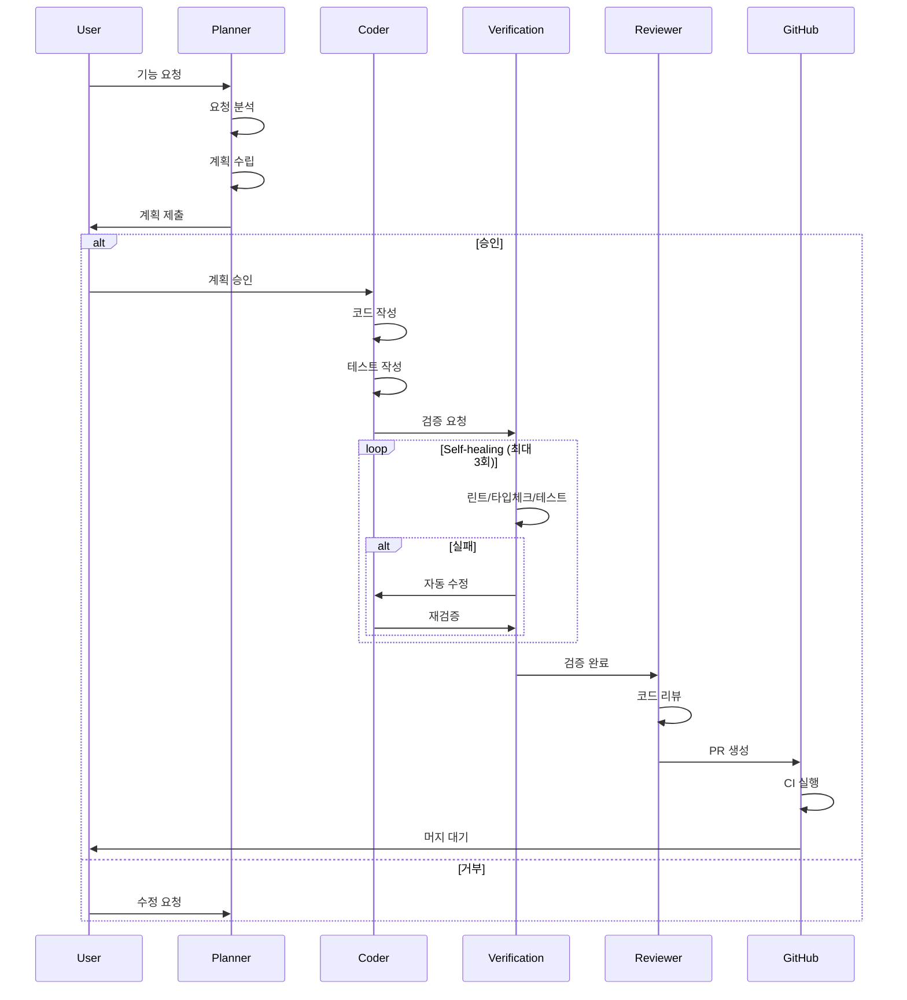
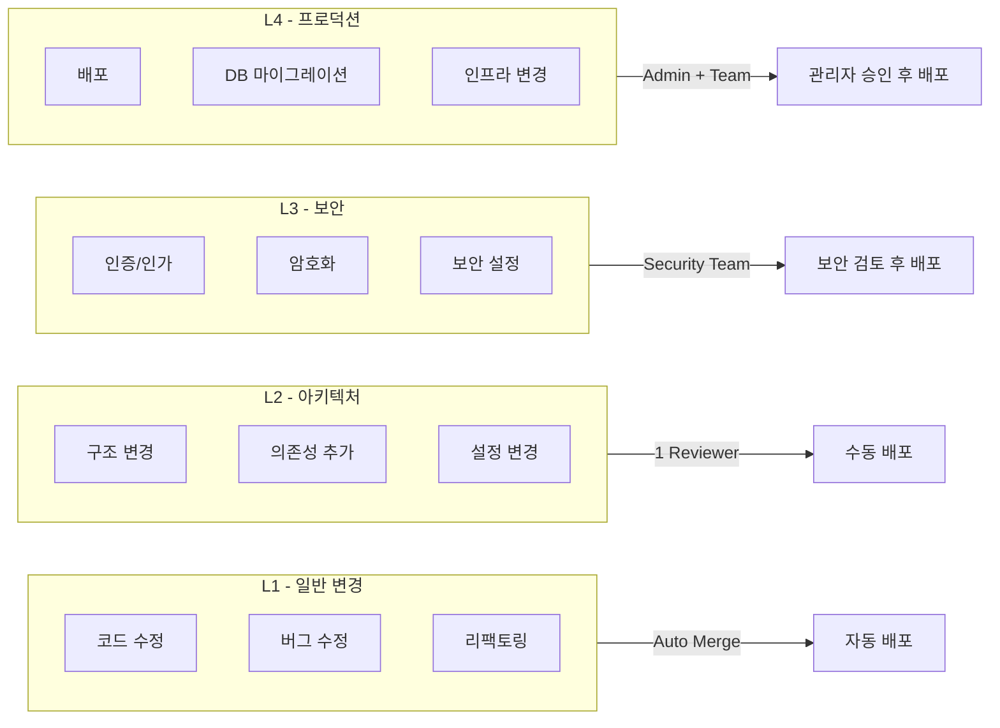
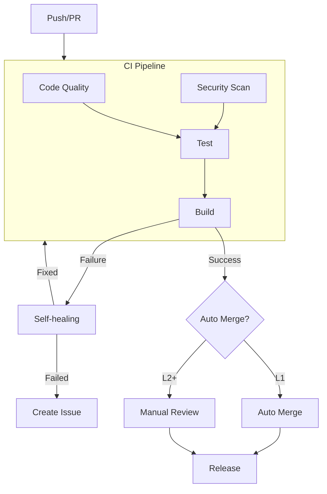
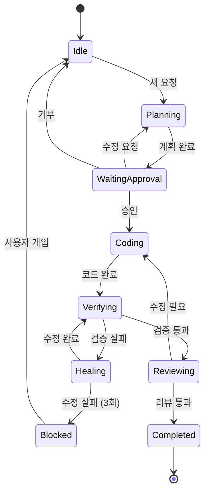
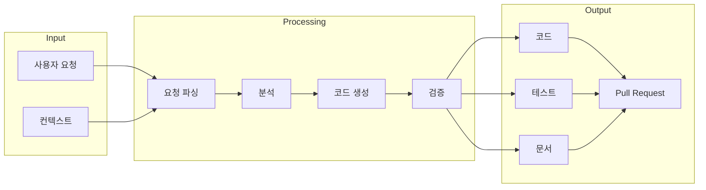

# System Diagrams

> Mermaid 다이어그램을 사용한 시스템 시각화

---

## 전체 아키텍처

```mermaid
flowchart TB
    subgraph User["👤 User (Orchestrator)"]
        Request[요청]
        Approve[승인/거부]
        Review[검토]
    end

    subgraph Agents["🤖 Agent Layer"]
        Planner[Planner Agent]
        Coder[Coder Agent]
        Reviewer[Reviewer Agent]
    end

    subgraph Skills["⚡ Skills Layer"]
        Interview[/interview]
        Commit[/commit]
        Test[/test]
        ReviewPR[/review-pr]
        Deploy[/deploy]
        Docs[/docs]
    end

    subgraph Verification["✅ Verification Layer"]
        Lint[ESLint]
        TypeCheck[TypeScript]
        UnitTest[Vitest]
        Security[Security Scan]
    end

    subgraph CICD["🔄 CI/CD"]
        CI[CI Pipeline]
        SelfHealing[Self-healing]
        AutoMerge[Auto Merge]
        Release[Release]
    end

    Request --> Planner
    Planner --> Approve
    Approve -->|Yes| Coder
    Coder --> Verification
    Verification -->|Pass| Reviewer
    Verification -->|Fail| SelfHealing
    SelfHealing -->|Fixed| Verification
    SelfHealing -->|Failed| Review
    Reviewer --> AutoMerge
    AutoMerge --> Release

    Planner -.-> Interview
    Coder -.-> Test
    Coder -.-> Commit
    Reviewer -.-> ReviewPR
```

---

## 워크플로우



---

## 승인 레벨



---

## CI/CD 파이프라인



---

## 에이전트 상태 머신



---

## 데이터 흐름



---

> 💡 **Tip**: VS Code에서 [Markdown Preview Mermaid Support](https://marketplace.visualstudio.com/items?itemName=bierner.markdown-mermaid) 확장을 설치하면 다이어그램을 미리볼 수 있습니다.
